# Meticulous Document Alignment Analysis & Merge Strategy

## Executive Summary
✅ **STRONG ALIGNMENT** - The four documents demonstrate excellent conceptual alignment on core architecture, design philosophy, and critical patterns. `AGENT.md` serves as the comprehensive canonical reference, while `CLAUDE.md` provides a concise briefing. The main opportunity is to merge `CLAUDE.md` into `AGENT.md` to create a single authoritative reference that maintains depth while improving accessibility.

## Detailed Alignment Analysis

### 1. Architecture Alignment (✅ EXCELLENT)
| Document | Architecture Description | Alignment Status |
|----------|---------------------------|------------------|
| `CLAUDE.md` | Hub-and-Spoke with Core/Tools separation | ✅ Perfect |
| `AGENT.md` | Detailed Hub-and-Spoke with visual diagram | ✅ Perfect |
| `PowerPoint_Tool_Development_Guide.md` | Same as `CLAUDE.md` | ✅ Perfect |
| `Powerpoint_Agent_Tools_Guide.md` | Stateless, atomic operations | ✅ Perfect |

**Key Consensus Points:**
- Core library (`powerpoint_agent_core.py`) as the central hub
- CLI tools as thin wrappers (spokes)
- Stateless architecture with context manager pattern
- JSON-first I/O for machine readability

### 2. Design Philosophy Alignment (✅ EXCELLENT)
| Document | Philosophy | Alignment Status |
|----------|------------|------------------|
| `CLAUDE.md` | "Atomic, Stateless, Composable, Visual-Aware" | ✅ Aligned |
| `AGENT.md` | "The Four Pillars" with detailed explanation | ✅ Enhanced version |
| Other docs | Consistent implementation of principles | ✅ Perfect |

**Evolution Observed:** `AGENT.md` provides the mature, detailed version of the philosophy introduced concisely in `CLAUDE.md`.

### 3. Critical Patterns Alignment (✅ EXCELLENT)
| Pattern | `CLAUDE.md` Coverage | `AGENT.md` Coverage | Alignment Status |
|---------|---------------------|---------------------|------------------|
| Inspection Pattern | ✅ Basic | ✅✅ Detailed with examples | ✅ Perfect |
| Positioning System | ✅ Basic types | ✅✅ Complete schemas | ✅ Perfect |
| Statelessness | ✅ Core concept | ✅✅ Detailed contract | ✅ Perfect |
| Shape Index Problem | ⚠️ Mentioned | ✅✅ Detailed with warning | ✅ Aligned |
| Overlay Pattern | ❌ Not covered | ✅✅ Detailed workflow | 🔄 Enhancement needed |
| Opacity vs Transparency | ❌ Not covered | ✅✅ Detailed with conversion | 🔄 Enhancement needed |

### 4. Tool Ecosystem Alignment (⚠️ MINOR DISCREPANCY)
| Document | Tool Count | Details | Alignment Status |
|----------|------------|---------|------------------|
| `CLAUDE.md` | "30+ tools" | Basic categories | ⚠️ Undercount |
| `AGENT.md` | "37+ tools" | Complete catalog | ✅ Authoritative |
| `Powerpoint_Agent_Tools_Guide.md` | 30 tools | Detailed catalog by domain | ⚠️ Needs update |

**Resolution:** `AGENT.md`'s count of 37+ tools is correct and authoritative. The discrepancy stems from newer tools being added after `CLAUDE.md` was created.

### 5. Error Handling Alignment (✅ GOOD)
| Document | Error Handling Depth | Alignment Status |
|----------|---------------------|------------------|
| `CLAUDE.md` | Basic exception catching | ⚠️ Minimal |
| `AGENT.md` | ✅✅ Structured JSON errors with types, suggestions, details | ✅ Comprehensive |
| Other docs | Practical troubleshooting | ✅ Complementary |

**Alignment Assessment:** `AGENT.md` provides the complete specification that `CLAUDE.md` hints at. No contradictions, just depth difference.

### 6. Development Workflow Alignment (✅ GOOD)
| Aspect | `CLAUDE.md` | `AGENT.md` | Alignment Status |
|--------|-------------|------------|------------------|
| Setup | Basic commands | ✅✅ Detailed environment setup | ✅ Compatible |
| Testing | Basic pytest commands | ✅✅ Comprehensive test requirements | ✅ Compatible |
| Contribution | Not covered | ✅✅ Detailed workflow & PR checklist | 🔄 Enhancement needed |

## Key Misalignments & Resolution Path

### 1. Tool Count Discrepancy
**Issue:** 30+ vs 37+ tools
**Resolution:** Adopt `AGENT.md`'s count as authoritative. Update all references to "37+ tools" to reflect current state.

### 2. Documentation Depth Gap
**Issue:** `CLAUDE.md` lacks detail on critical patterns, error handling, and contribution workflow
**Resolution:** Use `AGENT.md` as the canonical reference, incorporating `CLAUDE.md`'s concise explanations where helpful for readability.

### 3. Pattern Coverage Gaps
**Issue:** `CLAUDE.md` misses important patterns like Overlay Pattern and Opacity vs Transparency
**Resolution:** Ensure merged document includes all critical patterns from `AGENT.md`.

## Merge Strategy: `CLAUDE.md` + `AGENT.md` → `AGENT_SYSTEM_REFERENCE.md`

### Phase 1: Structure & Foundation
**Keep `AGENT.md`'s comprehensive structure** as the foundation, but incorporate `CLAUDE.md`'s concise explanations in key areas:

```
AGENT_SYSTEM_REFERENCE.md
├── 1. Project Identity (Enhance with CLAUDE.md's concise purpose statement)
├── 2. Architecture Overview (Keep AGENT.md's diagram + CLAUDE.md's brief explanation)
├── 3. Design Philosophy (Keep AGENT.md's Four Pillars + CLAUDE.md's one-liner)
├── 4. Programming Model (Keep AGENT.md's templates + CLAUDE.md's gotchas)
├── 5. Code Standards (Keep AGENT.md's detailed standards)
├── 6. Critical Patterns & Gotchas (Enhance with CLAUDE.md's concise warnings)
├── 7. Testing Requirements (Keep AGENT.md's comprehensive coverage)
├── 8. Contribution Workflow (Keep AGENT.md's detailed process)
└── 9. Quick Reference (Update tool count to 37+, keep AGENT.md's structure)
```

### Phase 2: Content Integration Points

#### 1. Project Identity Section
**Current (AGENT.md):** Detailed table and mission statement  
**Enhancement from CLAUDE.md:** Add concise one-liner at the top:
```
PowerPoint Agent Tools is a suite of 37+ stateless CLI utilities designed for AI agents to manipulate `.pptx` files.
```

#### 2. Architecture Overview
**Current (AGENT.md):** Detailed diagram and directory structure  
**Enhancement from CLAUDE.md:** Add concise explanation of runtime:
```
🛠️ Build & Runtime
Package Manager: `uv` (recommended) or `pip`
Python Version: 3.8+
Dependencies: `python-pptx`, `Pillow`, `pandas`, `LibreOffice` (for export)
```

#### 3. Critical Patterns Section
**Current (AGENT.md):** Comprehensive patterns with code examples  
**Enhancement from CLAUDE.md:** Add concise warning boxes for key gotchas:
```
🚨 CRITICAL GOTCHAS (from CLAUDE.md)
- NEVER guess shape indices - ALWAYS inspect first
- NEVER use raw position numbers - ALWAYS use Position Dictionary
- Chart limitations: Prefer re-creation over updating existing charts
```

#### 4. Quick Reference Section
**Update tool count** from "37+ tools" to match current reality
**Add common commands** from CLAUDE.md:
```
# Common Commands
uv pip install -r requirements.txt
uv python tools/ppt_get_info.py --file deck.pptx --json
pytest tests/
ruff check .
black .
```

### Phase 3: Quality Assurance Checklist

Before finalizing the merge, verify:

- [ ] All tool counts updated to reflect current state (37+ tools)
- [ ] All critical patterns from both documents preserved
- [ ] No contradictory information exists between sources
- [ ] JSON output standards remain consistent
- [ ] Error handling patterns are comprehensive
- [ ] Contribution workflow remains detailed and actionable
- [ ] Directory structure matches actual repository layout
- [ ] All code examples use consistent formatting and best practices
- [ ] Terminology is consistent throughout (e.g., "shape_index" vs "shape ID")
- [ ] All external dependencies are properly documented

### Phase 4: Implementation Plan

1. **Create new document** `AGENT_SYSTEM_REFERENCE.md` using `AGENT.md` as base
2. **Integrate CLAUDE.md content** at strategic points for conciseness and clarity
3. **Update tool counts** and references to reflect current state
4. **Add missing patterns** from `AGENT.md` that aren't in `CLAUDE.md` (Overlay Pattern, Opacity vs Transparency)
5. **Run validation** against the other two documents (`Powerpoint_Agent_Tools_Guide.md` and `PowerPoint_Tool_Development_Guide.md`) to ensure consistency
6. **Create migration guide** for teams currently using `CLAUDE.md`
7. **Archive obsolete documents** after sufficient transition period

## Final Recommendations

### 1. Document Consolidation Strategy
```
✅ KEEP: AGENT_SYSTEM_REFERENCE.md (merged canonical reference)
✅ KEEP: Powerpoint_Agent_Tools_Guide.md (technical reference for developers)
✅ KEEP: PowerPoint_Tool_Development_Guide.md (quick start for new contributors)
❌ ARCHIVE: CLAUDE.md (content merged into canonical reference)
```

### 2. Version Control & Maintenance
- Implement semantic versioning for the reference documents
- Add "Last Updated" timestamps to all documentation
- Create automated checks to ensure documentation stays in sync with code
- Establish quarterly documentation review cycle

### 3. Accessibility Improvements
- Add table of contents with anchor links
- Include a "Quick Start" section at the beginning for new contributors
- Create visual diagrams for complex concepts (like the Hub-and-Spoke architecture)
- Add search-friendly keywords throughout the document

### 4. Cross-Reference Enhancement
- Ensure all documents reference the canonical `AGENT_SYSTEM_REFERENCE.md`
- Create automatic redirect links for archived documents
- Add "See Also" sections to connect related documentation
- Implement consistent terminology across all project documentation

## Conclusion

The documents demonstrate **excellent conceptual alignment** with no fundamental contradictions. The primary opportunity is consolidation: merging `CLAUDE.md`'s concise clarity with `AGENT.md`'s comprehensive detail to create a single authoritative reference that serves both quick lookup and deep learning needs.

The proposed merge strategy preserves the depth and rigor of `AGENT.md` while incorporating `CLAUDE.md`'s accessibility improvements, resulting in documentation that scales from beginner to expert users while maintaining technical precision.

This approach embodies the project's core philosophy: **Atomic** (single source of truth), **Stateless** (self-contained documentation), **Composable** (reusable sections), and **Visual-Aware** (clear structure and hierarchy).

---

# 📚 AGENT SYSTEM REFERENCE

## 🔍 Quick Start Guide
**For new contributors and AI agents - get up and running in 60 seconds**

```bash
# 1. Clone the repository
git clone https://github.com/your-org/powerpoint-agent-tools.git
cd powerpoint-agent-tools

# 2. Install dependencies (using uv recommended)
uv pip install -r requirements.txt
uv pip install -r requirements-dev.txt

# 3. Run your first tool - get presentation info
uv run tools/ppt_get_info.py --file sample.pptx --json

# 4. Run tests to verify installation
pytest tests/ -v

# 5. Create a simple overlay (demonstrates core capabilities)
uv run tools/ppt_add_shape.py --file work.pptx --slide 0 --shape rectangle \
  --position '{ "left": "0%", "top": "0%"}' --size '{ "width": "100%", "height": "100%"}' \
  --fill-color "#FFFFFF" --fill-opacity 0.15 --json
```

**Key Concepts to Remember:**
- 🔒 **Always clone before editing** - never modify source files directly
- 🔍 **Probe before operating** - always inspect slide structure first
- 🔄 **Refresh indices** - shape indices change after structural operations
- 📊 **JSON-first I/O** - all tools output structured JSON for machine parsing
- ♿ **Accessibility-first** - validate contrast and alt text before delivery

---

## 📋 Table of Contents
[1. Project Identity & Mission](#1-project-identity--mission)  
[2. Architecture Overview](#2-architecture-overview)  
[3. Design Philosophy](#3-design-philosophy)  
[4. Programming Model](#4-programming-model)  
[5. Code Standards](#5-code-standards)  
[6. Critical Patterns & Gotchas](#6-critical-patterns--gotchas)  
[7. Testing Requirements](#7-testing-requirements)  
[8. Contribution Workflow](#8-contribution-workflow)  
[9. Quick Reference](#9-quick-reference)  
[10. Troubleshooting](#10-troubleshooting)  

---

## 1. Project Identity & Mission

### 🎯 Core Mission
**"Enabling AI agents to engineer presentations with precision, safety, and visual intelligence"**

PowerPoint Agent Tools is a suite of **37+ stateless CLI utilities** designed for AI agents to programmatically create, modify, and validate PowerPoint (`.pptx`) files. This project bridges the gap between complex presentation engineering and AI-driven automation.

### 🌟 Key Features
| Feature | Description | User Benefit |
|---------|-------------|--------------|
| **Stateless Architecture** | Each tool call is independent and self-contained | Reliable in distributed environments |
| **Atomic Operations** | Open → Modify → Save → Close pattern | Predictable, recoverable workflows |
| **Design Intelligence** | Typography scales, color theory, content density rules | Professionally designed outputs |
| **Accessibility First** | WCAG 2.1 compliance checking and remediation | Inclusive presentations for all audiences |
| **JSON-First I/O** | Structured machine-readable output | Easy integration with AI systems |
| **Clone-Before-Edit** | Automatic file safety with work copies | Zero risk to source materials |

### 🎯 Target Audience
- **AI Presentation Architects** - LLM-based agents that generate/modify presentations
- **Automation Engineers** - Building CI/CD pipelines for report generation
- **Human Developers** - Creating presentation automation workflows
- **Accessibility Specialists** - Ensuring compliance with accessibility standards

---

## 2. Architecture Overview

### 🏗️ Hub-and-Spoke Model


### 📂 Directory Structure
```
powerpoint-agent-tools/
├── core/
│   ├── __init__.py                    # Public API exports
│   ├── powerpoint_agent_core.py       # THE HUB - all core logic
│   └── strict_validator.py            # JSON Schema validation
├── tools/                             # THE SPOKES - 37+ CLI utilities
│   ├── ppt_add_shape.py
│   ├── ppt_get_info.py
│   ├── ppt_capability_probe.py
│   └── ... (34+ more tools)
├── schemas/                           # JSON Schemas for validation
│   ├── manifest.schema.json
│   ├── tool_output_schemas/
│   └── ...
├── tests/                             # Comprehensive test suite
│   ├── test_core.py
│   ├── test_shape_opacity.py
│   ├── test_tools/
│   └── ...
├── assets/                            # Test images, sample decks
├── AGENT_SYSTEM_PROMPT.md            # System prompt for AI agents
├── CONTRIBUTING_TOOLS.md              # Tool creation guide
└── requirements.txt                   # Dependencies
```

### 🔧 Key Components
| Component | Location | Responsibility | Keywords |
|-----------|----------|-----------------|----------|
| **PowerPointAgent** | `core/powerpoint_agent_core.py` | Context manager class for all operations | stateless, context-manager, file-locking |
| **CLI Tools** | `tools/ppt_*.py` | Thin wrappers with JSON I/O | atomic, composable, json-first |
| **Strict Validator** | `core/strict_validator.py` | JSON Schema validation with caching | schema-validation, data-integrity |
| **Position/Size Resolver** | `core/powerpoint_agent_core.py` | Convert %, inches, anchor, grid to absolute | responsive-design, spatial-awareness |
| **ColorHelper** | `core/powerpoint_agent_core.py` | Hex parsing, contrast calculation, WCAG compliance | accessibility, color-theory, contrast-ratio |

---

## 3. Design Philosophy

### 🏛️ The Four Pillars

```mermaid
flowchart LR
    A[STATELESS] --> E[VISUAL-AWARE]
    B[ATOMIC] --> E
    C[COMPOSABLE] --> E
    D[ACCESSIBLE] --> E
    
    A -->|Each call independent| F[No memory of previous calls]
    B -->|Open→Modify→Save→Close| G[One action per invocation]
    C -->|Chainable workflows| H[Output feeds next input]
    D -->|WCAG 2.1 compliance| I[Alt text, contrast, reading order]
    E -->|Design intelligence| J[Typography, color theory, layout systems]
```


### 📜 Core Principles
| Principle | Implementation | Why It Matters |
|-----------|----------------|----------------|
| **Clone Before Edit** | `ppt_clone_presentation.py` before any modification | Prevents accidental data loss |
| **Probe Before Operate** | `ppt_capability_probe.py --deep` to discover actual layouts | Avoids layout guessing errors |
| **JSON-First I/O** | All tools output structured JSON to stdout | Enables machine parsing and AI integration |
| **Fail Safely** | Incomplete is better than corrupted; validate before delivery | Ensures production-ready outputs |
| **Refresh After Structural Changes** | Re-query shape indices after add/remove/z-order operations | Prevents index invalidation errors |
| **Accessibility by Default** | Built-in WCAG validation with automatic remediation suggestions | Creates inclusive presentations |

### ⚖️ The Statelessness Contract
```python
# ✅ CORRECT: Each call is independent and self-contained
with PowerPointAgent(filepath) as agent:
    agent.open(filepath)
    agent.add_shape(
        slide_index=0,
        shape_type="rectangle",
        position={"left": "10%", "top": "10%"},
        size={"width": "20%", "height": "20%"},
        fill_color="#0070C0",
        fill_opacity=0.15  # Subtle overlay
    )
    agent.save()
# File is closed, lock released, no state retained

# ❌ WRONG: Assuming state persists between calls
agent.add_shape(...)  # Will fail - no file open
```

**Why Statelessness Matters:**
- AI agents may lose context between calls
- Prevents race conditions in parallel execution
- Enables pipeline composition and workflow orchestration
- Simplifies error recovery and debugging
- Makes the system predictable and deterministic

---

## 4. Programming Model

### 🛠️ Adding a New Tool Template
```python
#!/usr/bin/env python3
"""
PowerPoint [Action] [Object] Tool v3.x.x
[One-line description of tool purpose]

Author: PowerPoint Agent Team
License: MIT
Version: 3.x.x

Usage:
    uv run tools/ppt_[verb]_[noun].py --file deck.pptx [args] --json

Exit Codes:
    0: Success
    1: Error occurred
"""

import sys
import json
import argparse
from pathlib import Path
from typing import Dict, Any, Optional, List

# 1. PATH SETUP (required for imports without package install)
sys.path.insert(0, str(Path(__file__).parent.parent))

# 2. IMPORTS FROM CORE
from core.powerpoint_agent_core import (
    PowerPointAgent,
    PowerPointAgentError,
    SlideNotFoundError,
    ShapeNotFoundError,
    # ... other needed imports
)

# ============================================================================
# CONSTANTS
# ============================================================================

__version__ = "3.x.x"

# ============================================================================
# MAIN LOGIC FUNCTION
# ============================================================================

def do_action(
    filepath: Path,
    # ... other typed parameters
) -> Dict[str, Any]:
    """
    Perform the action on the PowerPoint file.
    
    Args:
        filepath: Path to PowerPoint file (absolute path required)
        # ... document all other arguments
        
    Returns:
        Dict with operation results containing:
            - status: "success" or "error"
            - file: Absolute path to modified file
            - action_specific_results: Tool-specific data
            
    Raises:
        FileNotFoundError: If file doesn't exist
        SlideNotFoundError: If slide index invalid
        ShapeNotFoundError: If shape index invalid
        ValueError: If parameters are invalid
        
    Example:
        >>> result = do_action(Path("/path/to/deck.pptx"), slide_index=0)
        >>> print(result["status"])
        'success'
    """
    # Validate file exists
    if not filepath.exists():
        raise FileNotFoundError(f"File not found: {filepath}")
    
    # Open, operate, save - STATELESS pattern
    with PowerPointAgent(filepath) as agent:
        agent.open(filepath)
        
        # ... perform operations via agent methods ...
         
        agent.save()
    
    # Return structured result
    return {
        "status": "success",
        "file": str(filepath),
        "tool_version": __version__,
        # ... action-specific fields
    }

# ============================================================================
# CLI INTERFACE
# ============================================================================

def main():
    parser = argparse.ArgumentParser(
        description="Tool description",
        formatter_class=argparse.RawDescriptionHelpFormatter,
        epilog="""
Examples:
  uv run tools/ppt_xxx.py --file deck.pptx --json
  uv run tools/ppt_xxx.py --file deck.pptx --slide 0 --shape rectangle --json
        """
    )
    
    # Required arguments
    parser.add_argument('--file', required=True, type=Path, help='PowerPoint file (absolute path)')
    
    # Optional arguments
    parser.add_argument('--json', action='store_true', default=True, help='JSON output (default: true)')
    
    args = parser.parse_args()
    
    try:
        result = do_action(filepath=args.file, ...)
        print(json.dumps(result, indent=2))
        sys.exit(0)
        
    except FileNotFoundError as e:
        error_result = {
            "status": "error",
            "error": str(e),
            "error_type": "FileNotFoundError",
            "suggestion": "Verify the file path exists and is accessible"
        }
        print(json.dumps(error_result, indent=2))
        sys.exit(1)
        
    except Exception as e:
        error_result = {
            "status": "error",
            "error": str(e),
            "error_type": type(e).__name__,
            "tool_version": __version__
        }
        print(json.dumps(error_result, indent=2))
        sys.exit(1)


if __name__ == "__main__":
    main()
```

### 🧩 Data Structures Reference

#### Position Dictionary
```json
// ✅ Percentage (Recommended - responsive)
{ "left": "10%", "top": "20%" }

// ✅ Inches (Absolute - precise positioning)
{ "left": 1.5, "top": 2.0 }

// ✅ Anchor-based (Layout-aware)
{ "anchor": "center", "offset_x": 0, "offset_y": -1.0 }

// ✅ Grid-based (12-column system)
{ "grid_row": 2, "grid_col": 3, "grid_size": 12 }
```

**Anchor Options:** `top_left`, `top_center`, `top_right`, `center_left`, `center`, `center_right`, `bottom_left`, `bottom_center`, `bottom_right`

#### Size Dictionary
```json
// ✅ Percentage (Responsive sizing)
{ "width": "50%", "height": "40%" }

// ✅ Inches (Fixed dimensions)
{ "width": 5.0, "height": 3.0 }

// ✅ Auto (Preserve aspect ratio)
{ "width": "50%", "height": "auto" }
```

#### Color System
```python
# ✅ Hex format (with or without #)
"#0070C0"
"0070C0"

# ✅ Preset semantic names
"primary"    # #0070C0 - Main brand color
"accent"     # #ED7D31 - Secondary emphasis
"success"    # #70AD47 - Positive indicators
"warning"    # #FFC000 - Caution items
"error"      # #FF0000 - Critical errors

# ✅ WCAG contrast checking
ColorHelper.contrast_ratio("#000000", "#FFFFFF")  # Returns 21.0 (excellent)
```

### ⚠️ Error Handling Pattern
```python
# In CLI tools - catch and convert to JSON
try:
    result = do_action(...)
    print(json.dumps(result, indent=2))
    sys.exit(0)

except FileNotFoundError as e:
    print(json.dumps({
        "status": "error",
        "error": str(e),
        "error_type": "FileNotFoundError",
        "details": {"path": str(e.filename)},
        "suggestion": "Verify the file path exists and you have read permissions"
    }, indent=2))
    sys.exit(1)

except SlideNotFoundError as e:
    print(json.dumps({
        "status": "error",
        "error": e.message,
        "error_type": "SlideNotFoundError",
        "details": e.details,
        "suggestion": "Use ppt_get_info.py to check available slides and indices"
    }, indent=2))
    sys.exit(1)

except PowerPointAgentError as e:
    print(json.dumps({
        "status": "error",
        "error": e.message,
        "error_type": type(e).__name__,
        "details": e.details,
        "tool_version": __version__
    }, indent=2))
    sys.exit(1)

except Exception as e:
    print(json.dumps({
        "status": "error",
        "error": f"Unexpected error: {str(e)}",
        "error_type": type(e).__name__,
        "tool_version": __version__,
        "suggestion": "Check logs and file permissions"
    }, indent=2))
    sys.exit(1)
```

---

## 5. Code Standards

### 📏 Style Requirements
| Aspect | Requirement | Keywords |
|--------|-------------|----------|
| **Python Version** | 3.8+ | compatibility, modern-python |
| **Type Hints** | Mandatory for all function signatures | type-safety, static-analysis |
| **Docstrings** | Required for all modules, classes, and functions | documentation, self-documenting |
| **Line Length** | 100 characters (soft limit) | readability, code-formatting |
| **Formatting** | `black` formatter with default settings | consistent-style, automated-formatting |
| **Linting** | `ruff` linter with no errors | code-quality, best-practices |
| **Imports** | Grouped: stdlib → third-party → local; alphabetized | organized-imports, dependency-management |

### 🏷️ Naming Conventions
| Element | Convention | Example | Keywords |
|---------|------------|---------|----------|
| **Tool files** | `ppt_<verb>_<noun>.py` | `ppt_add_shape.py` | descriptive-naming, verb-noun-pattern |
| **Core methods** | `snake_case` | `add_shape()`, `get_slide_info()` | pythonic-naming, consistency |
| **Private methods** | `_snake_case` | `_set_fill_opacity()` | internal-api, encapsulation |
| **Constants** | `UPPER_SNAKE_CASE` | `AVAILABLE_SHAPES` | configuration, immutability |
| **Classes** | `PascalCase` | `PowerPointAgent` | oop-patterns, type-safety |
| **Type aliases** | `PascalCase` | `PositionDict`, `SizeDict` | type-annotations, readability |

### 📖 Documentation Standards
```python
def method_name(
    self,
    required_param: str,
    optional_param: Optional[int] = None,
    **kwargs: Any
) -> Dict[str, Any]:
    """
    Short one-line description ending with period.
    
    Longer description if needed, explaining behavior,
    edge cases, and important notes. Focus on why and how.
    
    Args:
        required_param: Description of parameter with business context
        optional_param: Description with default noted (Default: None)
            Multi-line descriptions indented like this for clarity.
        **kwargs: Additional keyword arguments for extensibility
            
    Returns:
        Dict with the following keys:
            - key1 (str): Description of first key
            - key2 (int): Description of second key
            - success (bool): Whether operation completed successfully
            
    Raises:
        ValueError: When required_param is empty or invalid format
        SlideNotFoundError: When slide index doesn't exist in presentation
        PermissionError when file cannot be accessed
        
    Example:
        >>> agent = PowerPointAgent("deck.pptx")
        >>> result = agent.method_name("value", optional_param=42)
        >>> print(result["key1"])
        'expected output'
        >>> assert result["success"] is True
        
    Note:
        This method is idempotent - calling it multiple times with the same
        parameters will produce the same result. Performance note: O(n) complexity.
        
    See Also:
        related_method: For similar functionality with different parameters
        ppt_another_tool.py: CLI tool that uses this method
    """
```

### 📊 JSON Output Standards
**Success Response:**
```json
{
    "status": "success",
    "file": "/absolute/path/to/file.pptx",
    "action_specific_key": "value",
    "tool_version": "3.1.0",
    "presentation_version": "a1b2c3d4",
    "execution_time_ms": 125
}
```

**Warning Response (success with issues):**
```json
{
    "status": "warning",
    "file": "/absolute/path/to/file.pptx",
    "warnings": [
        "Shape index may have shifted - refresh with ppt_get_slide_info.py",
        "Low contrast ratio detected (3.8:1) - consider darker text"
    ],
    "result": {
        "shape_index": 5,
        "applied": true
    },
    "tool_version": "3.1.0"
}
```

**Error Response:**
```json
{
    "status": "error",
    "error": "File not found: /path/to/missing.pptx",
    "error_type": "FileNotFoundError",
    "details": {
        "path": "/path/to/missing.pptx",
        "attempted_operation": "open"
    },
    "suggestion": "Verify the file path exists and you have read permissions",
    "tool_version": "3.1.0"
}
```

---

## 6. Critical Patterns & Gotchas

### ⚠️ 1. The Shape Index Problem
```python
# ❌ WRONG - indices become stale after structural changes
shape1 = agent.add_shape(slide_index=0, ...)  # Returns shape_index: 5
shape2 = agent.add_shape(slide_index=0, ...)  # Returns shape_index: 6
agent.remove_shape(slide_index=0, shape_index=5)
agent.format_shape(slide_index=0, shape_index=6, ...)  # ❌ WRONG! It's now index 5!

# ✅ CORRECT - re-query after structural changes
shape1 = agent.add_shape(slide_index=0, ...)
shape2 = agent.add_shape(slide_index=0, ...)
agent.remove_shape(slide_index=0, shape_index=shape1["shape_index"])

# IMMEDIATELY refresh indices
slide_info = agent.get_slide_info(slide_index=0)  # ✅ Fresh indices

# Now find shape2 by name or other identifier
target_shape = next((s for s in slide_info["shapes"] if s["name"] == "shape2"), None)
if target_shape:
    agent.format_shape(slide_index=0, shape_index=target_shape["shape_index"], ...)
```

**Operations that invalidate indices:**
- `add_shape()` - adds new index at end
- `remove_shape()` - shifts all subsequent indices down
- `set_z_order()` - reorders indices based on visual stacking
- `delete_slide()` - invalidates all indices on that slide
- `add_slide()` - may shift slide indices if inserted in middle

### 🔍 2. The Probe-First Pattern
```python
# ❌ WRONG - guessing layout names or placeholder positions
agent.add_slide(layout_name="Title and Content")  # Might not exist in template!

# ✅ CORRECT - probe first to discover actual capabilities
probe_result = agent.capability_probe(deep=True)

# Extract available layouts
available_layouts = probe_result["layouts"]
print(f"Available layouts: {', '.join(available_layouts)}")
# Output: Available layouts: Title Slide, Content with Caption, Section Header

# Extract theme colors
theme_colors = probe_result["theme"]["colors"]
primary_color = theme_colors.get("accent1", "#0070C0")

# ✅ Use discovered values
agent.add_slide(layout_name=available_layouts[1])  # Safe selection
```

**The Deep Probe Innovation:**  
`ppt_capability_probe.py --deep` creates a transient slide in memory to measure actual placeholder geometry, then discards it. This is the **only reliable way** to know exact positioning and capabilities of a template.

### 🎨 3. The Overlay Pattern
```python
# ✅ CORRECT overlay workflow for text readability
WORK_FILE = Path("/path/to/work.pptx")

# 1. Add overlay shape with opacity
result = agent.add_shape(
    slide_index=0,
    shape_type="rectangle",
    position={"left": "0%", "top": "0%"},
    size={"width": "100%", "height": "100%"},
    fill_color="#FFFFFF",
    fill_opacity=0.15  # Subtle overlay (15% opaque) ✅
)

# 2. IMMEDIATELY refresh indices (MANDATORY after add)
slide_info = agent.get_slide_info(slide_index=0)

# 3. Send overlay to back (behind all content)
agent.set_z_order(
    slide_index=0,
    shape_index=result["shape_index"],
    action="send_to_back"
)

# 4. IMMEDIATELY refresh indices again (MANDATORY after z-order)
slide_info = agent.get_slide_info(slide_index=0)

# 5. Validate contrast (accessibility check)
validation = agent.check_accessibility(file=WORK_FILE)
if validation["contrast_issues"] > 0:
    print("⚠️ Contrast issues detected - overlay may be too dark")
```

### 🌓 4. Opacity vs Transparency
```python
# 📊 OPACITY SCALE (modern standard):
# 0.0 ←─────────────────────────→ 1.0
# Invisible                    Fully visible
# (see-through)                (solid)

# 📊 TRANSPARENCY SCALE (legacy, deprecated):
# 1.0 ←─────────────────────────→ 0.0
# Invisible                    Fully visible
# (see-through)                (solid)

# ✅ CONVERSION: opacity = 1.0 - transparency

# ✅ MODERN USAGE (preferred):
agent.add_shape(
    fill_color="#0070C0",
    fill_opacity=0.15  # 15% opaque = 85% transparent
)

# ⚠️ LEGACY USAGE (deprecated, for backward compatibility only):
agent.format_shape(
    transparency=0.85  # Will log warning and convert to fill_opacity=0.15
)
```

**The `transparency` parameter is DEPRECATED.** Use `fill_opacity` instead. The system automatically converts legacy calls but logs warnings.

### 🔐 5. File Handling Safety
```python
# ✅ ALWAYS use absolute paths
filepath = Path(filepath).resolve()  # Convert to absolute

# ✅ ALWAYS validate existence
if not filepath.exists():
    raise FileNotFoundError(f"File not found: {filepath}")

# ✅ ALWAYS use context manager for file operations
with PowerPointAgent(filepath) as agent:
    agent.open(filepath)
    # ... operations ...
    agent.save()  # Or agent.save(new_path) for save-as

# ✅ ALWAYS clone before editing (safety first)
agent.clone_presentation(
    source=Path("/source/template.pptx"),
    output=Path("/work/modified.pptx")
)

# ✅ NEVER modify source files directly
# ❌ Bad: agent.add_shape(file=Path("/source/template.pptx"), ...)
# ✅ Good: agent.add_shape(file=Path("/work/modified.pptx"), ...)
```

### ⚡ 6. XML Manipulation (Advanced)
```python
# When python-pptx doesn't expose a feature (like opacity):
from lxml import etree
from pptx.oxml.ns import qn

# Access shape XML structure
spPr = shape._sp.spPr

# Navigate XML tree to find solid fill
solidFill = spPr.find(qn('a:solidFill'))
if solidFill is None:
    # Create solid fill if it doesn't exist
    solidFill = etree.SubElement(spPr, qn('a:solidFill'))

# Find or create color element
color_elem = solidFill.find(qn('a:srgbClr'))
if color_elem is None:
    color_elem = etree.SubElement(solidFill, qn('a:srgbClr'))

# Create alpha element for transparency
alpha_elem = color_elem.find(qn('a:alpha'))
if alpha_elem is None:
    alpha_elem = etree.SubElement(color_elem, qn('a:alpha'))

# Set opacity (OOXML scale: 0 = invisible, 100000 = fully opaque)
opacity_value = 0.15  # 15% opaque
alpha_elem.set('val', str(int(opacity_value * 100000)))
```

**OOXML Alpha Scale:** 0 = invisible, 100000 = fully opaque  
**Warning:** Direct XML manipulation should be encapsulated in helper methods to maintain abstraction.

---

## 7. Testing Requirements

### 🧪 Test Structure
```
tests/
├── test_core.py                  # Core library unit tests
├── test_shape_opacity.py         # Feature-specific tests (opacity/transparency)
├── test_tools/                   # CLI tool integration tests
│   ├── test_ppt_add_shape.py
│   ├── test_ppt_get_info.py
│   ├── test_ppt_format_shape.py
│   └── ...
├── conftest.py                   # Shared fixtures and setup
├── test_utils.py                 # Test helper functions
└── assets/                       # Test files and resources
    ├── sample.pptx               # Basic test presentation
    ├── template.pptx             # Template with various layouts
    ├── corporate_template.pptx  # Corporate branding template
    └── images/                   # Test images for insertion
        ├── logo.png
        ├── chart.png
        └── background.jpg
```

### ✅ Required Test Coverage
| Category | What to Test | Example Test Cases |
|----------|--------------|-------------------|
| **Happy Path** | Normal usage succeeds | Add shape with valid parameters |
| **Edge Cases** | Boundary values (0, 1, max, empty) | Opacity=0.0, Opacity=1.0, empty text |
| **Error Cases** | Invalid inputs raise correct exceptions | Invalid slide index, non-existent file |
| **Validation** | Invalid ranges/formats rejected | Opacity=-0.1, Opacity=1.1 |
| **Backward Compatibility** | Old code still works | `transparency` parameter conversion |
| **CLI Integration** | Tool runs and produces valid JSON | Exit code 0, valid JSON output |
| **File Safety** | No source file modification | Source file hash unchanged after clone |
| **Accessibility** | WCAG compliance | Contrast ratio ≥ 4.5:1 |

### 🧪 Test Pattern Template
```python
import pytest
import tempfile
from pathlib import Path
import json

@pytest.fixture
def test_presentation(tmp_path):
    """Create a test presentation with blank slide."""
    pptx_path = tmp_path / "test.pptx"
    with PowerPointAgent() as agent:
        agent.create_new()
        agent.add_slide(layout_name="Blank")
        agent.save(pptx_path)
    return pptx_path

class TestAddShapeOpacity:
    """Tests for add_shape() method with opacity parameters."""
    
    def test_happy_path_opacity(self, test_presentation):
        """Test adding shape with valid opacity value."""
        with PowerPointAgent(test_presentation) as agent:
            agent.open(test_presentation)
            result = agent.add_shape(
                slide_index=0,
                shape_type="rectangle",
                position={"left": "10%", "top": "10%"},
                size={"width": "20%", "height": "20%"},
                fill_color="#0070C0",
                fill_opacity=0.5
            )
            agent.save()
         
        assert result["status"] == "success"
        assert result["styling"]["fill_opacity"] == 0.5
        assert result["styling"]["fill_opacity_applied"] is True
    
    def test_edge_case_opacity_zero(self, test_presentation):
        """Test opacity=0.0 (completely transparent)."""
        with PowerPointAgent(test_presentation) as agent:
            agent.open(test_presentation)
            result = agent.add_shape(
                slide_index=0,
                shape_type="rectangle",
                fill_color="#0070C0",
                fill_opacity=0.0
            )
            agent.save()
        
        assert result["styling"]["fill_opacity"] == 0.0
        # Note: Some PowerPoint versions may not render 0% opacity shapes
    
    def test_error_invalid_opacity(self, test_presentation):
        """Test that invalid opacity raises ValueError."""
        with PowerPointAgent(test_presentation) as agent:
            agent.open(test_presentation)
            
            with pytest.raises(ValueError) as excinfo:
                agent.add_shape(
                    slide_index=0,
                    shape_type="rectangle",
                    fill_color="#0070C0",
                    fill_opacity=1.5  # Invalid - must be <= 1.0
                )
            
            assert "must be between 0.0 and 1.0" in str(excinfo.value)
    
    def test_backward_compatibility_transparency(self, test_presentation):
        """Test deprecated transparency parameter works."""
        with PowerPointAgent(test_presentation) as agent:
            agent.open(test_presentation)
            result = agent.format_shape(
                slide_index=0,
                shape_index=0,
                transparency=0.85  # Should convert to fill_opacity=0.15
            )
            agent.save()
        
        assert "transparency_converted_to_opacity" in result["changes_applied"]
        assert result["changes_detail"]["converted_opacity"] == 0.15
```

### 🚀 Running Tests
```bash
# Run all tests with verbose output
pytest tests/ -v

# Run specific test file
pytest tests/test_shape_opacity.py -v

# Run specific test class
pytest tests/test_shape_opacity.py::TestAddShapeOpacity -v

# Run with coverage reporting
pytest tests/ --cov=core --cov-report=html
open htmlcov/index.html

# Run only fast tests (skip slow integration tests)
pytest tests/ -v -m "not slow"

# Run with detailed logging
pytest tests/ -v --log-cli-level=INFO

# Run and stop on first failure
pytest tests/ -v -x

# Run with parallel execution (faster)
pytest tests/ -v -n auto
```

---

## 8. Contribution Workflow

### 📋 Before Starting Work
1. **Understand the architecture** - Read this document fully
2. **Check existing tools** - Don't duplicate functionality
3. **Review the system prompt** - Understand how AI agents will use your code
4. **Set up environment:**
   ```bash
   uv pip install -r requirements.txt
   uv pip install -r requirements-dev.txt
   ```

### ✅ PR Checklist
**Before submitting a PR, verify all items:**

#### Code Quality
- [ ] Type hints on all function signatures
- [ ] Docstrings on all public functions/methods
- [ ] Follows naming conventions (snake_case, PascalCase)
- [ ] `black` formatted with no style violations
- [ ] `ruff` passes with no errors or warnings
- [ ] No hardcoded paths - use `pathlib.Path` throughout

#### For New Tools
- [ ] File named `ppt_<verb>_<noun>.py` (e.g., `ppt_add_overlay.py`)
- [ ] Uses standard template structure from Section 4
- [ ] Outputs valid JSON to stdout (no extra text)
- [ ] Uses exit code 0 for success, 1 for error
- [ ] Validates file paths with `pathlib.Path.exists()`
- [ ] Catches all exceptions and converts to JSON errors
- [ ] Includes `--json` flag for machine-readable output

#### For Core Changes
- [ ] Method has complete docstring with example
- [ ] Raises appropriate typed exceptions (not generic Exception)
- [ ] Returns Dict with documented structure
- [ ] Backward compatible (or deprecation path provided)
- [ ] Handles XML manipulation safely (if applicable)

#### Testing
- [ ] Tests cover happy path scenarios
- [ ] Tests cover edge cases (boundary values, empty inputs)
- [ ] Tests cover error cases (invalid inputs, missing files)
- [ ] All tests pass: `pytest tests/ -v`
- [ ] New functionality has corresponding tests

#### Documentation
- [ ] Updated relevant docstrings with new parameters/behavior
- [ ] Updated CHANGELOG.md if applicable
- [ ] Updated system prompt if new capability added
- [ ] Added examples for new features

### ⚠️ Common PR Mistakes to Avoid
| Mistake | Why It's Wrong | Correct Approach | Keywords |
|---------|----------------|-------------------|----------|
| **Printing non-JSON to stdout** | Breaks parsing by AI agents | Use stderr for logs, stdout for JSON only | json-first, machine-readable |
| **Assuming shape indices persist** | They shift after structural operations | Re-query after changes with `get_slide_info()` | index-refresh, structural-changes |
| **Not validating inputs** | Cryptic errors for end users | Validate early, fail fast with clear messages | input-validation, user-friendly |
| **Forgetting context manager** | File lock issues, resource leaks | Always use `with PowerPointAgent() as agent:` | resource-management, file-locking |
| **Hardcoding paths** | Platform-specific failures | Use `pathlib.Path` for cross-platform paths | cross-platform, path-handling |
| **Swallowing exceptions** | Silent failures, debugging nightmares | Log warning, return structured error status | error-handling, transparency |
| **Ignoring accessibility** | Creates barriers for users | Check contrast, add alt text, validate WCAG | inclusive-design, accessibility |

---

## 9. Quick Reference

### 🧰 Tool Catalog (37 Tools)
| Domain | Tools | Keywords |
|--------|-------|----------|
| **Creation** | `ppt_create_new`, `ppt_create_from_template`, `ppt_create_from_structure`, `ppt_clone_presentation` | initialization, templating, cloning |
| **Slides** | `ppt_add_slide`, `ppt_delete_slide`, `ppt_duplicate_slide`, `ppt_reorder_slides`, `ppt_set_slide_layout`, `ppt_set_footer` | slide-management, layout-control |
| **Content** | `ppt_set_title`, `ppt_add_text_box`, `ppt_add_bullet_list`, `ppt_format_text`, `ppt_replace_text`, `ppt_add_notes` | text-manipulation, content-editing |
| **Images** | `ppt_insert_image`, `ppt_replace_image`, `ppt_crop_image`, `ppt_set_image_properties` | image-handling, visual-content |
| **Shapes** | `ppt_add_shape`, `ppt_format_shape`, `ppt_add_connector`, `ppt_set_background`, `ppt_set_z_order`, `ppt_remove_shape` | vector-graphics, layering, overlays |
| **Data Viz** | `ppt_add_chart`, `ppt_update_chart_data`, `ppt_format_chart`, `ppt_add_table` | data-visualization, charts, tables |
| **Inspection** | `ppt_get_info`, `ppt_get_slide_info`, `ppt_extract_notes`, `ppt_capability_probe` | discovery, analysis, metadata |
| **Validation** | `ppt_validate_presentation`, `ppt_check_accessibility`, `ppt_export_images`, `ppt_export_pdf` | quality-assurance, accessibility, export |

### ⚡ Core Exceptions
| Exception | When Raised | Recovery Strategy | Keywords |
|-----------|-------------|-------------------|----------|
| **PowerPointAgentError** | Base exception for all agent errors | Catch and handle specific subclasses | base-exception, error-hierarchy |
| **SlideNotFoundError** | Invalid slide index | Run `ppt_get_info.py` to check available slides | index-validation, bounds-checking |
| **ShapeNotFoundError** | Invalid shape index | Run `ppt_get_slide_info.py` to refresh indices | shape-lookup, structural-changes |
| **LayoutNotFoundError** | Layout name doesn't exist | Use probe to discover available layouts | template-awareness, dynamic-discovery |
| **ValidationError** | Schema or content validation failed | Check error details and fix input data | data-integrity, schema-validation |
| **PermissionError** | File access denied | Verify file permissions and path existence | file-permissions, access-control |

### 📏 Key Constants
```python
# Slide dimensions (default - 16:9 aspect ratio)
SLIDE_WIDTH_INCHES = 10.0
SLIDE_HEIGHT_INCHES = 7.5

# Content density limits (6×6 rule)
MAX_BULLETS_PER_SLIDE = 6
MAX_WORDS_PER_BULLET = 6
MIN_FONT_SIZE_PT = 12  # For body text

# Accessibility thresholds (WCAG 2.1 AA)
MIN_CONTRAST_RATIO = 4.5  # For normal text
MIN_LARGE_CONTRAST_RATIO = 3.0  # For large text (18pt+ or bold 14pt+)

# Overlay defaults (for text readability)
OVERLAY_OPACITY = 0.15  # 15% opaque
OVERLAY_Z_ORDER = "send_to_back"  # Always behind content

# File safety
WORK_COPY_SUFFIX = "_work"  # For cloned files
MAX_FILE_SIZE_MB = 100  # Maximum file size to process
```

### 🚀 Common Commands
```bash
# 🔍 Deep probe to discover template capabilities
uv run tools/ppt_capability_probe.py --file template.pptx --deep --json

# 📝 Add slide with specific layout
uv run tools/ppt_add_slide.py --file deck.pptx --layout "Title and Content" --json

# 🎨 Add overlay shape for text readability
uv run tools/ppt_add_shape.py --file deck.pptx --slide 0 --shape rectangle \
  --position '{ "left": "0%", "top": "0%"}' --size '{ "width": "100%", "height": "100%"}' \
  --fill-color "#FFFFFF" --fill-opacity 0.15 --json

# 🔢 Refresh shape indices after structural changes
uv run tools/ppt_get_slide_info.py --file deck.pptx --slide 0 --json

# 📊 Validate accessibility compliance
uv run tools/ppt_check_accessibility.py --file deck.pptx --json

# 💾 Export final presentation as PDF
uv run tools/ppt_export_pdf.py --file deck.pptx --output deck.pdf --json

# 🧪 Run all tests with coverage
pytest tests/ --cov=core --cov-report=html
```

---

## 10. Troubleshooting

### 🔧 Common Exit Code 1 Errors
| Error | Cause | Fix | Keywords |
|-------|-------|-----|----------|
| **`SlideNotFoundError`** | Requested index `5` but deck only has `5` slides (indices 0-4) | Run `ppt_get_info.py` to check `slide_count` | zero-based-indexing, bounds-checking |
| **`LayoutNotFoundError`** | Requested "Title Slide" but template calls it "Title" | Run `ppt_get_info.py` to see the `layouts` list | template-awareness, dynamic-discovery |
| **`ImageNotFoundError`** | Tool cannot access image path | Use absolute paths or ensure agent's working directory is correct | file-paths, resource-access |
| **`InvalidPositionError`** | Malformed JSON in `--position` argument | Ensure strict JSON syntax (double quotes for keys/strings) | json-syntax, data-validation |
| **`FileLockError`** | File already open by another process | Wait or ensure proper cleanup of previous operations | concurrency, resource-management |
| **`ContrastRatioError`** | Text contrast below WCAG threshold | Use `ppt_format_text.py` to adjust text color | accessibility, wcag-compliance |

### 🛠️ Debugging Tips
1. **Enable verbose logging** - Set environment variable `LOG_LEVEL=DEBUG`
2. **Check file permissions** - Ensure read/write access to all files
3. **Validate JSON inputs** - Use online JSON validators for complex parameters
4. **Test with sample files** - Start with `assets/sample.pptx` before real files
5. **Check disk space** - Ensure ≥100MB free space for operations
6. **Verify dependencies** - Run `uv pip list` to confirm all packages installed

### 🔄 Recovery Strategies
```bash
# If operation fails, restore from backup
cp presentation_backup.pptx presentation.pptx

# Reset work copy from original
uv run tools/ppt_clone_presentation.py --source original.pptx --output work.pptx --json

# Validate file integrity
uv run tools/ppt_validate_presentation.py --file work.pptx --json

# Extract recoverable content to new file
uv run tools/ppt_create_from_structure.py --structure recovered.json --output recovered.pptx --json
```

### 🆘 Support Resources
- **Documentation**: This reference document + `AGENT_SYSTEM_PROMPT.md`
- **Examples**: `tests/` directory contains working examples
- **Community**: #powerpoint-agent channel in project Slack
- **Issue Tracking**: GitHub Issues with labels:
  - `bug` - Critical functionality issues
  - `enhancement` - Feature requests
  - `documentation` - Documentation improvements
  - `question` - Usage questions
- **Emergency Support**: `@maintainer` for production-critical issues

---

## 🏁 Final Directive

**You are a Presentation Architect—not a slide typist.** Your mission is to engineer presentations that communicate with clarity, persuade with evidence, delight with thoughtful design, and remain accessible to all audiences.

**Every slide must be:**
- ✅ **Accessible** to all audiences
- ✅ **Aligned** with visual design principles  
- ✅ **Validated** against quality standards
- ✅ **Documented** for auditability

**Every operation must be:**
- ✅ **Preceded** by probe and preflight checks
- ✅ **Tracked** with presentation versions
- ✅ **Followed** by index refresh (if structural)
- ✅ **Logged** in the change manifest

**Every decision must be:**
- ✅ **Deliberate** and defensible
- ✅ **Documented** with rationale
- ✅ **Reversible** through rollback commands

**Every delivery must include:**
- ✅ **Executive summary** of changes
- ✅ **Change documentation** with audit trail
- ✅ **Validation results** (structural, accessibility, design)
- ✅ **Next step recommendations** for improvement

---

**Document Version:** 1.0.0  
**Last Updated:** November 26, 2025  
**Keywords:** powerpoint, presentation, automation, ai-agent, cli-tools, accessibility, wcag, opacity, transparency, shape-index, file-locking, json-first, stateless-architecture
